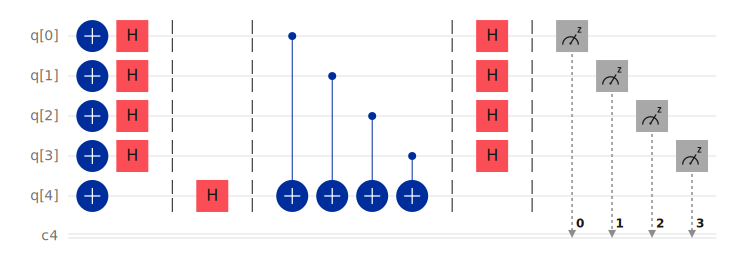

# Bell State Preparation

This folder contains the implementation of a **Bell state preparation circuit** created using **IBM Quantum Composer** and exported as OpenQASM.

Bell states are maximally entangled two–qubit states that form the basis of many quantum information protocols such as:

- quantum teleportation
- superdense coding
- quantum cryptography

---

## Circuit Diagram

---

## Description

The circuit prepares a two–qubit Bell state using a **Hadamard gate** followed by a **CNOT gate**.

1. A Hadamard gate is applied to the first qubit to create a superposition.
2. A CNOT gate entangles the two qubits.
3. Both qubits are then measured.

The resulting quantum state is

$|\Phi^{+}\rangle = \frac{1}{\sqrt{2}}\left(|00\rangle + |11\rangle\right)$

This state represents a maximally entangled system where both qubits are perfectly correlated.

---

## Measurement Outcomes

When the qubits are measured, the possible outcomes are:

| Result | Probability |
|------|-------------|
| 00 | 50% |
| 11 | 50% |

The outcomes **01** and **10** do not occur due to the entanglement between the qubits.

---

## Files in this folder

- `bell_state.qasm` — OpenQASM representation of the quantum circuit.
- `bell_state.svg` — visual diagram of the circuit exported from IBM Quantum Composer.

---

## Platform Used

This circuit was designed and simulated using:

- IBM Quantum Composer  
- IBM Quantum Experience  
- OpenQASM 2.0
