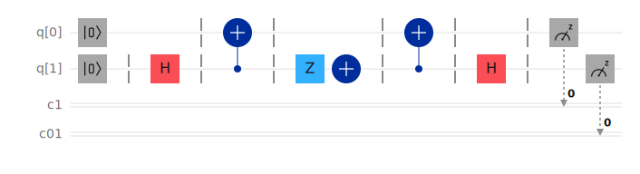
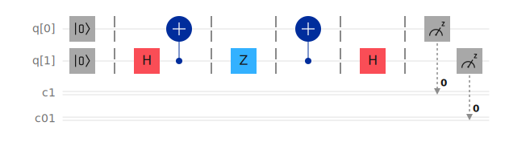

# Superdense Coding

This folder contains implementations of the **Superdense Coding protocol** created using **IBM Quantum Composer** and exported as **OpenQASM** and **SVG circuit diagrams**.

Superdense coding is a quantum communication protocol that uses **entanglement** to transmit **two classical bits of information using a single qubit**, provided that the sender and receiver share a previously prepared entangled pair.

---

# Files in this folder

### Original circuit (Repository version)

* `superdense_coding.qasm` — OpenQASM representation of the circuit exported from IBM Quantum Composer
* `superdense_coding.svg` — Vector diagram of the circuit

### Alternative circuit (second implementation)

* `superdense_coding_alt.qasm` — OpenQASM representation of an alternative implementation of Superdense Coding
* `superdense_coding_alt.svg` — Vector diagram of the alternative circuit

---

# Circuit diagram

### Original implementation



### Alternative implementation



---

# Short description of the protocol

The Superdense Coding protocol consists of four main steps.

---

## 1. Bell-state preparation

Two qubits are initialized in the state

$$
|00\rangle
$$

A **Hadamard gate** followed by a **CNOT gate** creates the entangled Bell state

$$
|\Phi^{+}\rangle =
\frac{|00\rangle + |11\rangle}{\sqrt{2}}
$$

This entangled pair is shared between:

* **Alice** (sender)
* **Bob** (receiver)

---

## 2. Encoding

Alice encodes **two classical bits** by applying one of the **Pauli operators** to her qubit.

| Classical bits | Operation                                     |
| -------------- | --------------------------------------------- |
| `00`           | Identity $I$                                  |
| `01`           | $X$                                           |
| `10`           | $Z$                                           |
| `11`           | $XZ$ (equivalent to $Y$ up to a global phase) |

After encoding, Alice **sends her qubit to Bob**.

---

## 3. Decoding

Bob now possesses **both qubits of the entangled pair**.
He performs the **Bell-basis measurement circuit**:

1. Apply **CNOT**
2. Apply **Hadamard**

These operations transform the entangled state into the **computational basis**, allowing the classical message to be read.

---

## 4. Measurement

Finally, both qubits are measured, yielding the **two classical bits encoded by Alice**.

---

# Encoding ↔ Expected measurement mapping

| Classical bits (sender) | Encoding on sender's qubit | Expected measurement outcome |
| ----------------------- | -------------------------- | ---------------------------- |
| `00`                    | `I`                        | `00`                         |
| `01`                    | `X`                        | `01`                         |
| `10`                    | `Z`                        | `10`                         |
| `11`                    | `XZ`                       | `11`                         |

> **Note:** The displayed bitstring order returned by simulators (e.g., `result.get_counts()`) may depend on the measurement ordering in the `.qasm` file.

---

# Difference between the two circuits

Both circuits implement the **same Superdense Coding protocol**, but they differ in the **qubit orientation and gate placement**.

---

## Original circuit

The original implementation prepares entanglement as

$$
H(q_0)
$$

followed by

$$
\text{CNOT}(q_0 \rightarrow q_1)
$$

This produces the Bell state

$$
|\Phi^{+}\rangle = \frac{|00\rangle + |11\rangle}{\sqrt{2}}
$$

Alice performs the encoding on **$q_0$**, and Bob performs decoding with

$$
\text{CNOT}(q_0 \rightarrow q_1)
$$

followed by

$$
H(q_0)
$$

---

## Alternative circuit

In the alternative implementation the qubits are swapped.

Entanglement is created as

$$
H(q_1)
$$

followed by

$$
\text{CNOT}(q_1 \rightarrow q_0)
$$

Encoding is therefore applied on **$q_1$**, and the decoding circuit is adjusted accordingly.

---

# Why both circuits are valid

The difference between the two implementations corresponds to a **qubit relabeling transformation**

$$
q_0 \leftrightarrow q_1
$$

Since the decoding stage compensates for this swap, both circuits produce the **same final measurement outcomes**.

Both implementations therefore:

* create a **Bell pair**
* apply a **Pauli encoding**
* perform **Bell-basis decoding**
* recover **two classical bits**

Thus they are **equivalent realizations of the Superdense Coding protocol**.

---

# How to run the `.qasm` file with Qiskit

```python
# example_run.py
from qiskit import QuantumCircuit, Aer, execute

qc = QuantumCircuit.from_qasm_file("superdense_coding.qasm")

print(qc.draw(output='text'))

backend = Aer.get_backend('qasm_simulator')
job = execute(qc, backend=backend, shots=1024)

result = job.result()
counts = result.get_counts()

print("Counts:", counts)
```

To run the alternative circuit:

```python
qc = QuantumCircuit.from_qasm_file("superdense_coding_alt.qasm")
```
